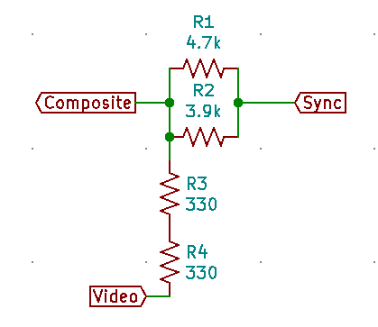
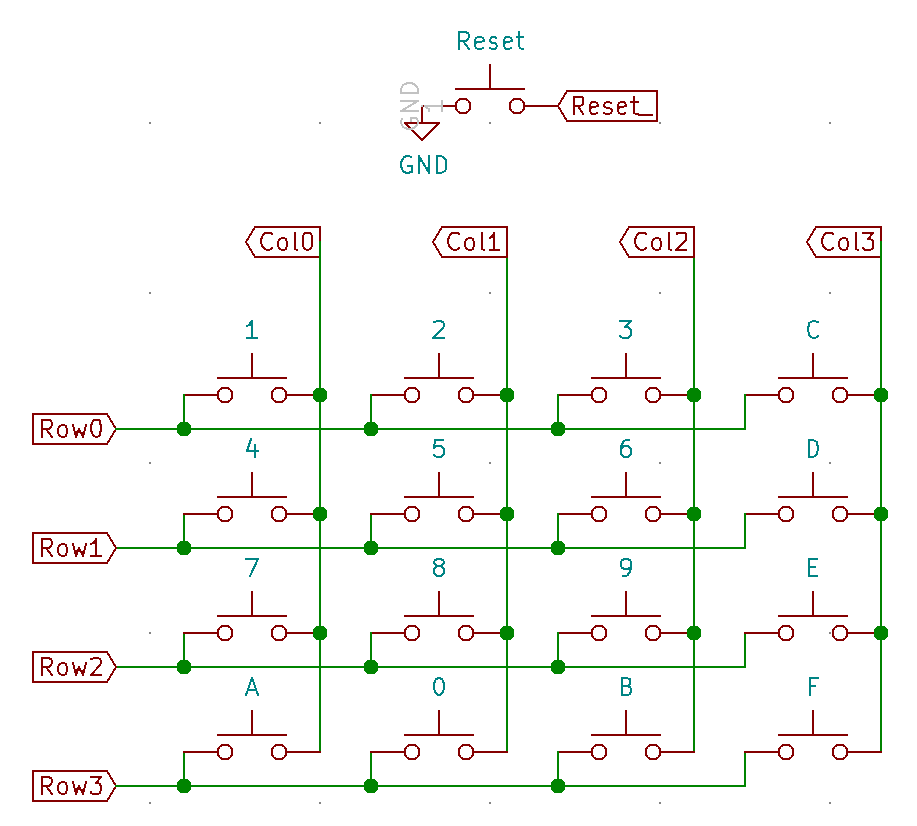
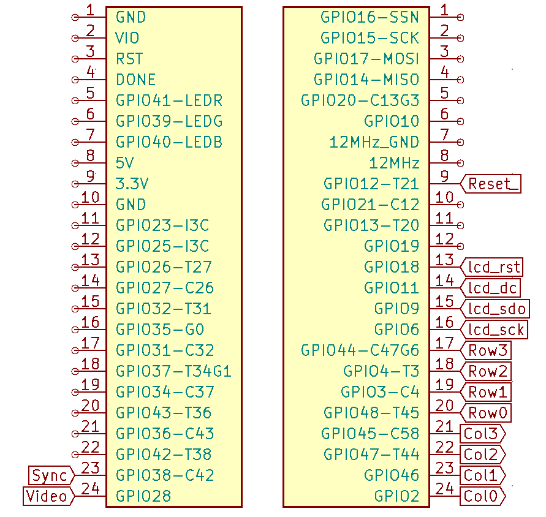

# FPGACosmacVIP
Is a implementation of the COSMAC VIP computer system from mid to late 1970s implemented in an FPGA.

The computer system is built around a [RCA CDP1802](https://en.wikipedia.org/wiki/RCA_1802) by [Joseph Weisbecker](http://www.cosmacelf.com/history/joseph-weisbecker.html). For a Video Display Controller it uses a [RCA CDP1861](https://en.wikipedia.org/wiki/RCA_CDP1861) also known as the Pixie.  It has a max resoluton of 64x128.

Both the 1802 and 1861 implementations are designed from the datasheets to be cycle accurate.

## SpinalHDL Install & Usage 
1. For installing I suggest using [VS Code](https://code.visualstudio.com/) with the extension [Metals](https://marketplace.visualstudio.com/items?itemName=scalameta.metals) it handles installing all the needed packages for SpinalHDL to run.  
If you want other options for install SpinalHDL use the [Getting Stated](https://spinalhdl.github.io/SpinalDoc-RTD/SpinalHDL/Getting%20Started/getting_started.html) page.

2. If you choose to use VS Code with metals, then opening this repo in VS Code with Metals installed, should begin the process of installing packages. Once it's done, Metals will complain about the version of Scala.

3. Open src/main/scala/rtl/Top.scala, scroll to the bottom. right above line 172 you should see `build | debug`.  Click build.  If it worked you should have a Top.v file in the root of the repo.

4. If using the UPduino 3.0 board, head to the folder UPduino3, in there is bash script `run.sh`.  The main thing to note here is that nextpnr-ice40 has the added flag of `--opt-timing`, without this the timing will not be meet.  

## FPGA Specifics
1. The system clock is derived from a 17.625MHz clock, generated by the PLL which is then divide by 10, giving the system a clock rate of 1.7625MHz which is close to the 1.7606MHz of the original system.

2. If your targeting a different FPGA you just need a clock signal in the ballpark of 17.6064Mhz.

3. When using the optional LCD the internal 48Mhz oscillator in the ice40 is used to drive the LCD logic.  The faster this clock is the more frames it will be able to display. The LCD has a max spi clock of 25Mhz reading the datasheet. The SPI clock rate is input Clock/2, so 48Mhz is a 24Mhz SPI clock.
I have found that these LCD's can still work at a SPI clock of 42Mhz and still be stable.

## External Hardware Connections

The resistors where select based on trying different combinations of common resistors in LTSpice, to get the right output voltages.

This should be the layout of any 4x4 key matrix.  

### Optional LCD
If you want to use the `ILI9341 2.2" 240x320 LCD`, on line 174 in Top.scala, change the `false` to `true`, right before the RAM/ROM file paths. This will add the hardware to drive the LCD.  One thing to note when using the LCD is that it doesn't have the bandwidth over SPI to draw every frame, and displays about 1 out of 4 frames vs what is shown in the video output.   

## Ram / Rom
1. Changing what programs are placed into the RAM/ROM with FPGA configuration, is done on line 174 in Top.scala.

2. The files in the data folder starting with Chip8_***.bin, have the CHIP8 interrupter places in 0000h-01ffh, and the CHIP8 program/game placed at 0200h-0EA0h.

3. RAM bin files need to be a length of 1FFFh or 8,191 bytes

4. ROM bin files need to be a length of 01ffh or 511 bytes

## Operation
1. After power on, or a Reset the rom is mapped to 0000h-01FFh

2. The Monitor Program toggles the N4 output line on the CPU, to remove the 
remapping of the ROM and continues running at 8008h.

3. This allows the Monitor Program to run if C key on the keypad is held during boot. If the C key is not held, normal execution starts at 0000h of RAM

## Monitor Program Summary
1. Reset released with C key held selects monitor program.

2. Enter four-digit address followed by mode digit:
    * A = MR (Memory Read)          
    * 0 = MW (Memory Write)          
    * B = TR (Tape Read) Hardware not implemented 
    * F = TW (Tape Write) Hardware not implemented

3. The address is only shown after it is entered fully, and mode is never indicated.
4. Selecting a new mode requires a reset and re-entering the monitor program.
5. When the monitor program is run the CPU registers are saved from R3 to RF into memory. this shows up at the bottom the screen as random pixels.

## Dumped Registers Addresses   
Memory Address | Register Byte | Memory address | Register Byte
---------------|---------------|----------------|--------------
0FB0h         | ---           | 0FC0h          | ---
0FB1h         | ---           | 0FC1h          | ---
0FB2h         | ---           | 0FC2h          | ---
0FB3h         | R3.0          | 0FC3h          | R3.1
0FB4h         | R4.0          | 0FC4h          | R4.1
0FB5h         | R5.0          | 0FC5h          | R5.1
0FB6h         | R6.0          | 0FC6h          | R6.1
0FB7h         | R7.0          | 0FC7h          | R7.1
0FB8h         | R8.0          | 0FC8h          | R8.1
0FB9h         | R9.0          | 0FC9h          | R9.1
0FBAh         | RA.0          | 0FCAh          | RA.1
0FBBh         | RB.0          | 0FCBh          | RB.1
0FBCh         | RC.0          | 0FCCh          | RC.1
0FBDh         | RD.0          | 0FCDh          | RD.1
0FBEh         | RE.0          | 0FCEh          | RE.1
0FBFh         | RF.0          | 0FCFh          | RF.1

## Memory Map 
Location | Use 
---------|----
 0x0000 - 0x01FF  | CHIP-8 Interpreter
 0x0200 - 0x0EA0  | User programs using CHIP-8
 0x0EA0 - 0x0ECF  | CHIP-8 stack (48 bytes max. for up to 12 levels of subroutine nesting)
 0x0ED0 - 0x0EEF  | Reserved for CHIP-8 Interpreter work area
 0x0EF0 - 0x0EFF  | CHIP-8 registers V0-VF
 0x0F00 - 0x0FFF  | 256-bytes of RAM area for display routine
 0x1000 - 0x1FFF  | Free RAM
 0x8000 - 0x81FF  | Rom area for monitor program and display routine 